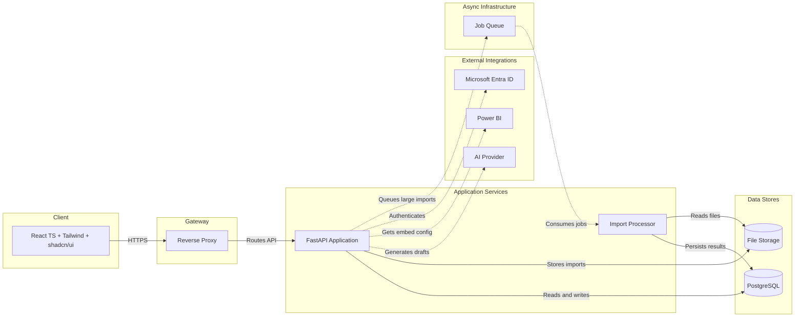

# System Architecture

## Context

The first release is a modular monolith. React owns the user experience, FastAPI
owns application behavior, PostgreSQL owns operational data, and Power BI owns
deeper analytical exploration. The AI Provider is an external adapter that only
returns draft content.

## Architecture diagram

The `Import Processor` and `Job Queue` are reserved for large-file or long-running
work. The MVP may execute small imports synchronously through the same application
interface; adding a queue is an implementation change only when workload evidence
justifies it.

## Module interfaces

### Authentication and authorization

The interface accepts an authenticated request context and returns the current
User or a permission failure. Routes do not implement role rules themselves.

### Customer module

The interface supports Customer search, retrieval, creation, update, ownership,
Interactions, and Follow-up queries. It owns Customer invariants and exposes
schemas rather than ORM instances.

### Import module

The interface accepts a bounded CSV/XLSX file and an import policy. It returns an
Import Job summary, preview rows, and row-level Import Errors. It either commits a
validated batch or reports rejected rows; it never silently accepts partial data.

### Analytics module

The interface accepts allowlisted filters and returns KPI summaries and chart-ready
series. KPI formulas are defined in the product scope and tested independently of
the chart library.

### AI Email module

The interface accepts a Customer context identifier, purpose, language, and tone.
It returns an Email Draft. The AI adapter is behind a seam so a fake adapter can be
used in tests and demos.

### Power BI module

The interface accepts an authenticated User and report key, then returns only the
short-lived embed configuration needed by the client. Entra credentials and
Power BI secrets never cross this interface to React.

## Main request flows

### Import

1. React uploads a bounded file to FastAPI.
2. FastAPI creates an Import Job and validates file metadata.
3. The import module parses and normalizes rows.
4. The User receives a preview and row-level errors.
5. Confirmation opens one database transaction for accepted rows.
6. The Import Job and Audit Log are finalized.

### AI Email Draft

1. Staff selects a Customer and email purpose.
2. FastAPI builds a minimized, explicit context payload.
3. The AI adapter returns structured subject/body content.
4. FastAPI stores an Email Draft with provider metadata and prompt version.
5. Staff reviews and edits the draft.
6. Approval marks the draft ready for a future sending workflow; no email is sent.

### Power BI

1. React asks FastAPI for a report configuration.
2. FastAPI authenticates against the configured Entra/Power BI flow.
3. FastAPI returns report ID, embed URL, and short-lived token/configuration.
4. React embeds the report and handles loading, expiry, and failure states.

## Deployment assumptions

- One web application and one PostgreSQL database for the first release.
- Development uses Docker Compose and synthetic data.
- Production uses a dedicated WSGI/ASGI-capable server for FastAPI, never the development server.
- File storage starts local or S3-compatible behind an adapter.
- Secrets are provided by environment or an approved secret manager.
