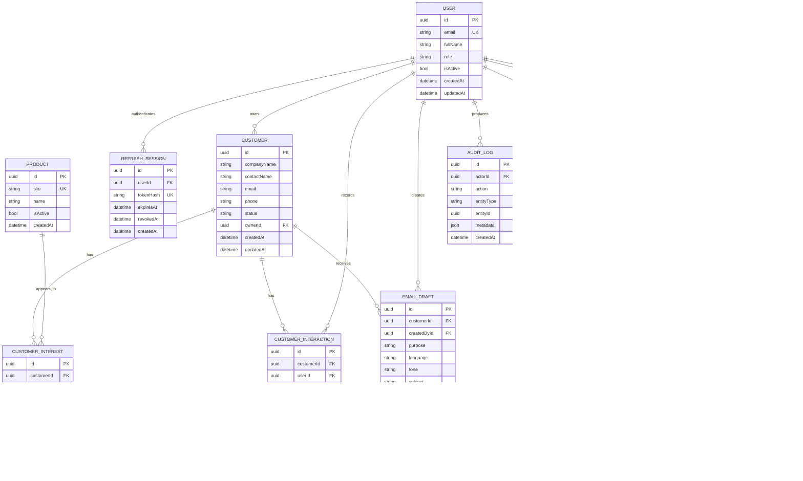

# Database Schema

## ER diagram

## Invariants

- `USER.email` and `PRODUCT.sku` are unique after normalization.
- `CUSTOMER.ownerId`, `EMAIL_DRAFT.createdById`, and ticket user references must point to active or historically valid Users.
- `CUSTOMER_INTEREST` is unique on `(customer_id, product_id)`.
- `IMPORT_ERROR` belongs to exactly one Import Job and is immutable after the job is finalized.
- `EMAIL_DRAFT.status` is one of `draft`, `reviewed`, `approved`, or `rejected`.
- Only a human Staff/Admin action can transition an Email Draft to `reviewed` or `approved`.
- `SUPPORT_TICKET.status` is one of `open`, `in_progress`, `waiting`, `resolved`, or `closed`.
- `AUDIT_LOG` is append-only and never stores passwords, tokens, full AI prompts, or full email bodies.
- All timestamps are stored in UTC.

## Index plan

- `customers(owner_id, status)` for Staff lists and follow-up views.
- `customers(email)` for duplicate detection.
- `customer_interactions(customer_id, occurred_at DESC)` for timelines.
- `import_errors(import_job_id, row_number)` for error review.
- `email_drafts(customer_id, created_at DESC)` for history.
- `support_tickets(status, priority, assignee_id)` for work queues.
- `audit_logs(entity_type, entity_id, created_at DESC)` for investigation.

## Migration policy

Every schema change is an Alembic migration. Applied migrations are immutable.
Destructive changes use an expand-and-contract sequence and require a recovery
plan before execution.
