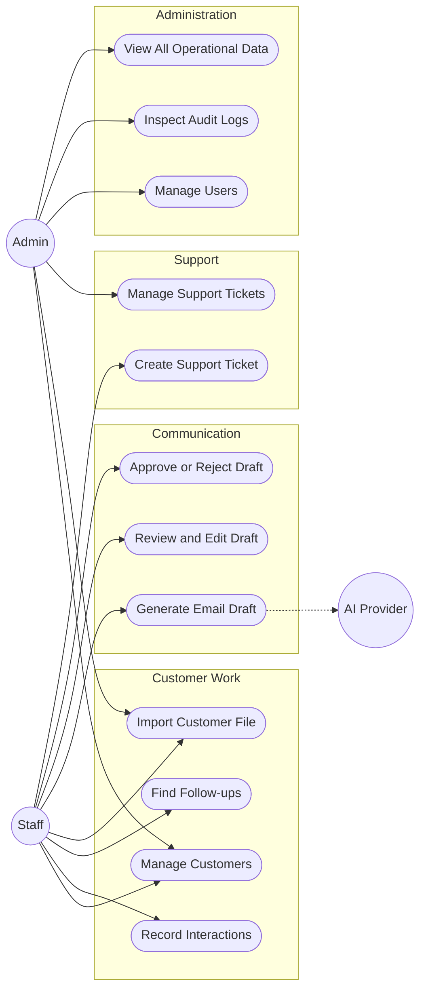

# Use Cases and Permissions

## Use-case map

Mermaid has no native UML use-case renderer in the diagram workflow, so this map
uses actors and actions while preserving the same intent.

## Permission matrix

| Capability | Staff | Admin |
| --- | :---: | :---: |
| View assigned Customers | Yes | Yes |
| View all Customers | No | Yes |
| Create/update assigned Customers | Yes | Yes |
| Import customer files | Yes | Yes |
| View import errors | Own jobs | All jobs |
| View operational dashboard | Assigned scope | All scope |
| Generate Email Draft | Yes | Yes |
| Review/edit Email Draft | Yes | Yes |
| Approve/reject Email Draft | Yes | Yes |
| Create Support Ticket | Yes | Yes |
| Assign or resolve tickets | No | Yes |
| Manage Users | No | Yes |
| View Audit Logs | No | Yes |
| Request Power BI embed config | Scoped | All scope |

## Critical acceptance scenarios

### Import

- Given a valid file, when Staff previews and confirms it, accepted rows are committed once.
- Given invalid rows, when Staff previews the file, each error has a row number, field, and actionable message.
- Given a duplicate email, when Staff confirms the import, the duplicate is rejected according to the import policy and is not silently overwritten.

### Email Draft

- Given a Customer and purpose, when Staff requests generation, an Email Draft is saved as `draft`.
- Given a generated draft, when Staff edits it, the edited content is preserved.
- Given a draft, when Staff approves it, its state becomes `approved` but no sending side effect occurs.

### Access

- Given a Staff User, when they request another Staff member's Customer, the backend denies access.
- Given an Admin, when they inspect the same Customer, access is granted and the read is auditable where policy requires it.

### Support

- Given a Staff User, when they create a ticket, it starts as `open` and belongs to its creator.
- Given an Admin, when they assign and resolve a ticket, each transition is recorded in the Audit Log.
